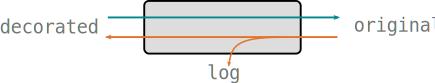
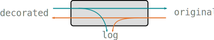

StreamUtils: Power-ups for Arduino Streams
==========================================


[](https://github.com/bblanchon/ArduinoStreamUtils/actions/workflows/ci.yml)
[](https://coveralls.io/github/bblanchon/ArduinoStreamUtils)
[](https://www.ardu-badge.com/StreamUtils/1.7.1)
[](https://registry.platformio.org/packages/libraries/bblanchon/StreamUtils?version=1.7.1) 

The *stream* is an essential abstraction in Arduino; we find it in many places:

* [`HardwareSerial`](https://www.arduino.cc/reference/en/language/functions/communication/serial/)
* [`SoftwareSerial`](https://www.arduino.cc/en/Reference/SoftwareSerial)
* [`File`](https://www.arduino.cc/en/Reference/SD)
* [`EthernetClient`](https://www.arduino.cc/en/Reference/EthernetClient)
* [`WiFiClient`](https://www.arduino.cc/en/Reference/WiFiClient)
* [`Wire`](https://www.arduino.cc/en/reference/wire)
* and many others...

This library provides some helper classes and functions for dealing with streams. 

For example, with this library, you can:

* speed up your program by buffering the data it reads from a file
* reduce the number of packets sent over WiFi by buffering the data you send
* improve the reliability of a serial connection by adding error correction codes
* debug your program more easily by logging what it sends to a Web service
* send large data with the [Wire library](https://www.arduino.cc/en/reference/wire)
* use a `String`, EEPROM, or `PROGMEM` with a stream interface

Read on to see how StreamUtils can help you!


How to add buffering to a Stream?
---------------------------------

### Buffering read operations

Sometimes, you can significantly improve performance by reading many bytes at once. 
For example, [according to SPIFFS's wiki](https://github.com/pellepl/spiffs/wiki/Performance-and-Optimizing#reading-files), reading read files in chunks of 64 bytes is much faster than reading them one byte at a time.


To buffer the input, decorate the original `Stream` with `ReadBufferingStream`. For example, suppose your program reads a JSON document from SPIFFS like that:

```c++
File file = SPIFFS.open("example.json", "r");
deserializeJson(doc, file);
```

Then you only need to insert one line to greatly improve the reading speed:

```c++
File file = SPIFFS.open("example.json", "r");
ReadBufferingStream bufferedFile{file, 64};  // <- HERE
deserializeJson(doc, bufferedFile);
```

Unfortunately, this optimization is only possible if:

1. `Stream.readBytes()` is declared `virtual` in your Arduino Code (as it's the case for ESP8266), and
2. the derived class has an optimized implementation of `readBytes()` (as it's the case for SPIFFS' `File`).

When possible, prefer `ReadBufferingClient` to `ReadBufferingStream` because `Client` defines a `read()` method similar to `readBytes()`, except that this one is `virtual` on all platforms.

If memory allocation fails, `ReadBufferingStream` behaves as if no buffer was used: it forwards all calls to the upstream `Stream`.

Adding a buffer only makes sense for **unbuffered** streams. For example, there is **no benefit to adding a buffer to serial ports** because they already include an internal buffer.

### Buffering write operations

Similarly, you can improve performance significantly by writing many bytes at once.
For example, writing to `WiFiClient` one byte at a time is very slow; it's much faster if you send large chunks.


To add a buffer, decorate the original `Stream` with  `WriteBufferingStream`. For example, if your program sends a JSON document via `WiFiClient`, like that:

```c++
serializeJson(doc, wifiClient);
```

Rewrite it like this:

```c++
WriteBufferingStream bufferedWifiClient{wifiClient, 64};
serializeJson(doc, bufferedWifiClient);
bufferedWifiClient.flush();
```

`flush()` sends the remaining data; if you forget to call it, the end of the message will be missing. The destructor of `WriteBufferingStream` calls `flush()`, so you can remove this line if you destroy the decorator immediately.

If memory allocation fails, `WriteBufferingStream` behaves as if no buffer was used: it forwards all calls to the upstream `Stream`.

Adding a buffer only makes sense for **unbuffered** streams. For example, there is **no benefit to adding a buffer to serial ports** because they already include an internal buffer.

How to add logging to a stream?
-------------------------------

### Logging write operations

When debugging a program that makes HTTP requests, you first want to check whether the request is correct. With this library, you can decorate the `EthernetClient` or the `WiFiClient` to log everything to the serial.


For example, if your program is:

```c++
client.println("GET / HTTP/1.1");
client.println("User-Agent: Arduino");
// ...
```

Then, create the decorator and update the calls to `println()`:

```c++
WriteLoggingStream loggingClient(client, Serial);
loggingClient.println("GET / HTTP/1.1");
loggingClient.println("User-Agent: Arduino");
// ...
```

Everything you write to `loggingClient` is written to `client` and logged to `Serial`.


### Logging read operations

Similarly, you often want to see what the HTTP server sent back. With this library, you can decorate the `EthernetClient` or the `WiFiClient` to log everything to the serial.



For example, if your program is:

```c++
char response[256];
client.readBytes(response, 256);
```

Then, create the decorator and update the calls to `readBytes()`:

```c++
ReadLoggingStream loggingClient(client, Serial);
char response[256];
loggingClient.readBytes(response, 256);
// ...
```

`loggingClient` forwards all operations to `client` and logs read operations to `Serial`.

⚠ **WARNING** ⚠   
If your program receives data from one serial port and logs to another, **ensure the latter runs at a much higher baud rate**. Logging must be at least ten times faster, or it will slow down the receiving port, which may drop incoming bytes.

### Logging read and write operations

Of course, you could log read and write operations by combining `ReadLoggingStream` and `WriteLoggingStream`, but there is a simpler solution: `LoggingStream`.



As usual, if your program is:

```c++
client.println("GET / HTTP/1.1");
client.println("User-Agent: Arduino");

char response[256];
client.readBytes(response, 256);
```

Then decorate `client` and replace the calls:

```c++
LoggingStream loggingClient(client, Serial);

loggingClient.println("GET / HTTP/1.1");
loggingClient.println("User-Agent: Arduino");

char response[256];
loggingClient.readBytes(response, 256);
```

How to use error-correction codes (ECC)?
----------------------------------------

StreamUtils supports the [Hamming(7, 4)](https://en.wikipedia.org/wiki/Hamming(7,4)) error-correction code, which encodes 4 bits of data into 7 bits by adding three parity bits.
These extra bits increase the amount of traffic but allow correcting any one-bit error within the 7 bits.

If you use this encoding on an 8-bit channel, it effectively doubles the amount of traffic. However, if you use an [`HardwareSerial`](https://www.arduino.cc/reference/en/language/functions/communication/serial/) instance (like `Serial`, `Serial1`...), you can slightly reduce the overhead by configuring the ports as a 7-bit channel, like so:

```c++
// Initialize serial port with 9600 bauds, 7-bits of data, no parity, and one stop bit
Serial1.begin(9600, SERIAL_7N1);
```

### Adding parity bits

The class `HammingEncodingStream<7, 4>` decorates an existing `Stream` to include parity bits in every write operation.


You can use this class like so:

```c++
HammingEncodingStream<7, 4> eccSerial(Serial1);

eccSerial.println("Hello world!");
```

Like every `Stream` decorator in this library, `HammingEncodingStream<7, 4>` supports all `Stream` methods (like `print()`, `println()`, `read()`, `readBytes()`, and `available()`).

### Correcting errors

The class `HammingDecodingStream<7, 4>` decorates an existing `Stream` to decode parity bits in every read operation.


You can use this class like so:

```c++
HammingDecodingStream<7, 4> eccSerial(Serial1);

char buffer[256];
size_t n = eccSerial.readBytes(buffer, n);
```

Like every `Stream` decorator in this library, `HammingDecodingStream<7, 4>` supports all `Stream` methods (like `print()`, `println()`, `read()`, `readBytes()`, and `available()`).

### Encoding and decoding in both directions

The class `HammingStream<7, 4>` combines the features of `HammingEncodingStream<7, 4>` and `HammingDecodingStream<7, 4>`, which is very useful when you do two-way communication.


You can use this class like so:

```c++
HammingStream<7, 4> eccSerial(Serial1);

eccSerial.println("Hello world!");

char buffer[256];
size_t n = eccSerial.readBytes(buffer, n);
```

Like every `Stream` decorator in this library, `HammingStream<7, 4>` supports all `Stream` methods (like `print()`, `println()`, `read()`, `readBytes()`, and `available()`).


How to retry write operations?
------------------------------

Sometimes, a stream is limited to the capacity of its internal buffer. In that case, you must wait before sending more data.
To solve this problem, StreamUtils provides the `WriteWaitingStream` decorator:


This function repeatedly waits and retries until it times out.
You can customize the `wait()` function; by default, it's [`yield()`](https://www.arduino.cc/en/Reference/SchedulerYield).

For example, if you want to send more than 32 bytes with the [Wire library](https://www.arduino.cc/en/reference/wire), you can do the following:

```c++
WriteWaitingStream wireStream(Wire, [](){
  Wire.endTransmission(false); // <- don't forget this argument
  Wire.beginTransmission(address);
});

Wire.beginTransmission(address); 
wireStream.print("This is a very very long message that I'm sending!");
Wire.endTransmission();
```

As you can see, we use the `wait()` function as a hook to flush the Wire transmission buffer. Notice that we pass `false` to [`endTransmission()`](https://www.arduino.cc/en/Reference/WireEndTransmission) so that it sends the data but doesn't actually stop the transmission.


How to use a `String` as a stream?
---------------------

### Writing to a `String`

Sometimes, you use a piece of code that expects a `Print` instance (like `ReadLoggingStream`), but you want the output in a `String` instead of a regular `Stream`.
In that case, use the `StringPrint` class. It wraps a `String` within a `Print` implementation.


Here is how you can use it:

```c++
StringPrint stream;

stream.print("Temperature = ");
stream.print(22.3);
stream.print(" °C");

String result = stream.str();
```

At the end of this snippet, the string `result` contains:

```
Temperature = 22.30 °C
```

### Reading from a `String`

Similarly, there are cases where you have a `String`, but you need to pass a `Stream` to some other piece of code. In that case, use `StringStream`; it's similar to `StrintPrint`, except you can also read from it.


How to use EEPROM as a stream?
------------------------------

SteamUtils also allows using EEPROM as a stream. Create an instance of `EepromStream` and specify the start address and the size of the region you want to expose.


For example, it allows you to save a JSON document in EEPROM:

```c++
EepromStream eepromStream(0, 128);
serializeJson(doc, eepromStream);
eepromStream.flush();  // <- calls EEPROM.commit() on ESP (optional)
```

In the same way, you can read a JSON document from EEPROM:

```c++
EepromStream eepromStream(0, 128);
deserializeJson(doc, eepromStream);
```


How to use `PROGMEM` as a stream?
------------------------------

SteamUtils also allows reading `PROGMEM` buffers with a `Stream` interface.


Create an instance of `ProgmemStream` and pass the pointer to the `PROGMEM` buffer.

```c++
const char buffer[] PROGMEM = "This string is in program memory"
ProgmemStream stream{buffer};
Serial.println(stream.readString());
```

`ProgmemStream`'s constructor also supports `const __FlashStringHelper*` (the type returned by the `F()` macro) and an optional second argument to specify the size of the buffer.


Summary
-------

Some of the decorators are also available for the `Print` and `Client` classes.
See the equivalence table below.

| Purpose                            | `Client`                | `Stream`                | `Print`          |
|:-----------------------------------|:------------------------|:------------------------|:-----------------|
| Log *write* operations             | `WriteLoggingClient`    | `WriteLoggingStream`    | `LoggingPrint`   |
| Log *read* operations              | `ReadLoggingClient`     | `ReadLoggingStream`     |                  |
| Log *read* and *write* op.         | `LoggingClient`         | `LoggingStream`         |                  |
| Buffer *write* operations          | `WriteBufferingClient`  | `WriteBufferingStream`  | `BufferingPrint` |
| Buffer *read* operations           | `ReadBufferingClient`   | `ReadBufferingStream`   |                  |
| Repeat *write* operations          | `WriteWaitingClient`    | `WriteWaitingStream`    | `WaitingPrint`   |
| Use `String` as a stream           |                         | `StringStream`          | `StringPrint`    |
| Use EEPROM as a stream             |                         | `EepromStream`          |                  |
| Use `PROGMEM` as a stream          |                         | `ProgmemStream`         |                  |
| Error correction (decode only)     | `HammingDecodingClient` | `HammingDecodingStream` |                  |
| Error correction (encode only)     | `HammingEncodingClient` | `HammingEncodingStream` | `HammingPrint`   |
| Error correction (encode & decode) | `HammingClient`         | `HammingStream`         |                  |

Prefer `XxxClient` to `XxxStream` because, unlike `Stream::readBytes()`, `Client::read()` is virtual on all cores and therefore allows optimized implementations.


Portability
-----------

This library relies on `Client`, `Print`, and `Stream` definitions, which unfortunately differ from one core to another.

It has been tested on the following cores:

* [AVR](https://github.com/arduino/ArduinoCore-avr)
* [ESP32](https://github.com/espressif/arduino-esp32)
* [ESP8266](https://github.com/esp8266/Arduino)
* [nRF52](https://github.com/adafruit/Adafruit_nRF52_Arduino)
* [SAMD](https://github.com/arduino/ArduinoCore-samd)
* [STM32 Official](https://github.com/stm32duino/Arduino_Core_STM32)
* [STM32 Roger's Core](https://github.com/rogerclarkmelbourne/Arduino_STM32) (no EEPROM support)
* [Teensy](https://github.com/PaulStoffregen/cores)

If your core is not supported, please [open an issue](https://github.com/bblanchon/ArduinoStreamUtils/issues/new).
Thank you for your understanding.
